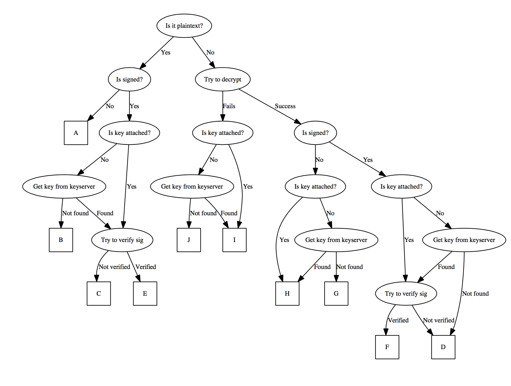

# PGPbuddy

Want to set up PGP but don't know how? PGPbuddy is here to help! Email PGPbuddy and she will help you set up and configure PGP by checking you are properly signing and encrypting messages. 

# Requirements

    pip install pyyaml python-gnupg schedule pyzmail

# Configuration

Best is to generate a new set of public + private keys for buddy. Run the following

    mkdir credentials
    gpg --gen-key --homedir credentials
    
Generate a new config file by runnning

    cp config.default.yaml config.yaml

and in `config.yaml` set your email server parameters and the directory that contains buddy's keyrings (e.g. `credentials`).

Also generate a revocation certificate in case your keys are lost or compromised and store in a backup location:

	gpg --homedir credentials --output buddyrevoke.asc --gen-revoke buddyskey

	
# Bot Logic

Here are all the possible responses that PGPBuddy can return:

* Response A: Plaintext with no signature. Return intro email. Response is not signed and not encrypted.
* Response B: Plaintext with signature but cannot find their public key to verify the signature. Response is signed but not encrypted.
* Response C: Plaintext with signature but signature fails to verify. Return reason why the signature verification failed. Response is signed but not encrypted (in case the reason the signature failed is because we have the wrong key). 
* Response D: Signed ciphertext with signature not verified either because of an error or because we cannot find their key. Response is signed but not encrypted. 
* Response E: Plaintext with signature and signature verifies. Return success! Return signed and but not encrypted. 
* Response F: Signed ciphertext with key found and signature verified. Return success! Return signed and encrypted response.
* Response G: Unsigned ciphertext with key not found. Return success and note that the message is unsigned. Response is signed but not encrypted (since we cannot find their key). 
* Response H: Unsigned ciphertext and we found their key. Return success and note that the message is unsigned. Response is encrypted and signed. 
* Response I: Ciphertext, decryption fails. Return failure and reason why decrypt fails. Response is signed and encrypted. 
* Response J: Ciphertext, decryption fails, and we can't find their public key. Return failure and reason why decrypt fails. Response is signed but not encrypted (since we cannot find their key). 
